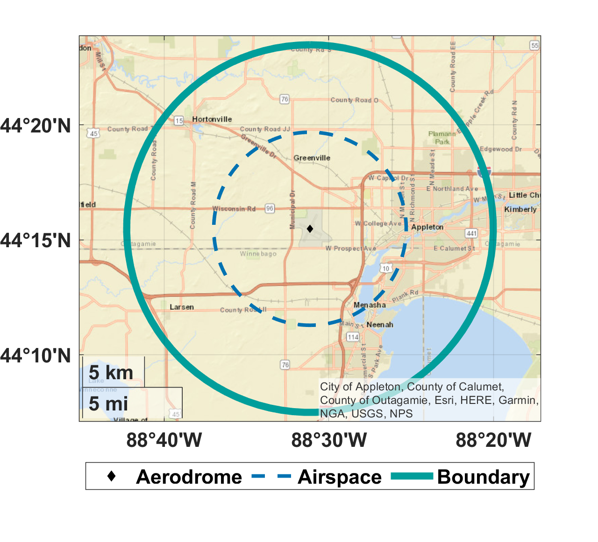
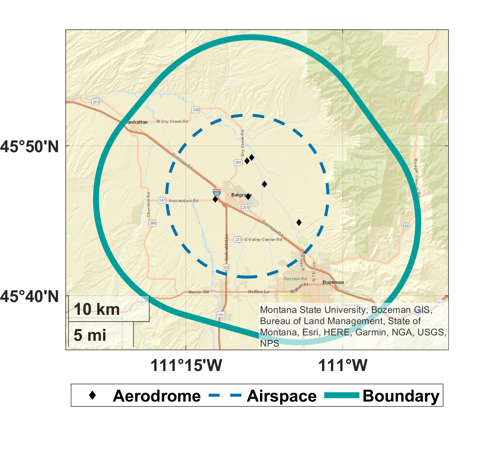
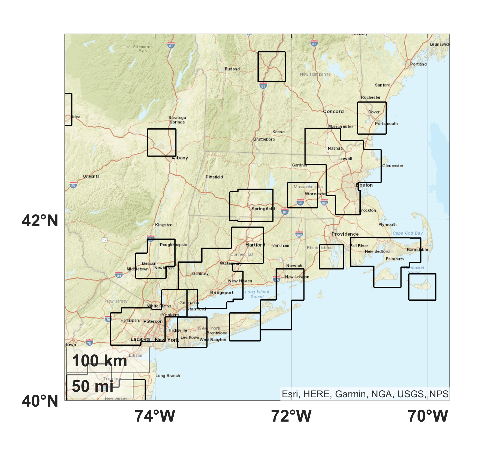
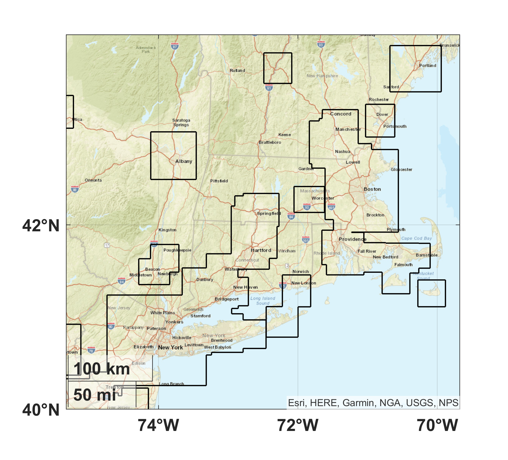
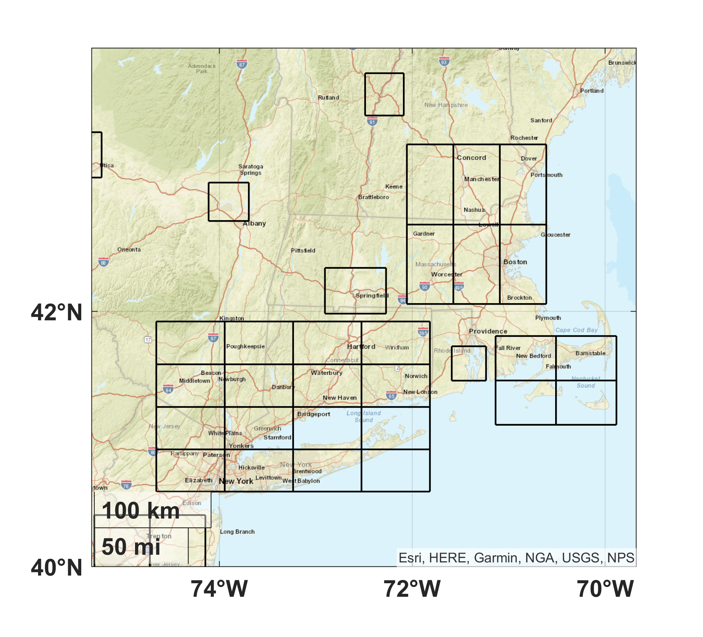
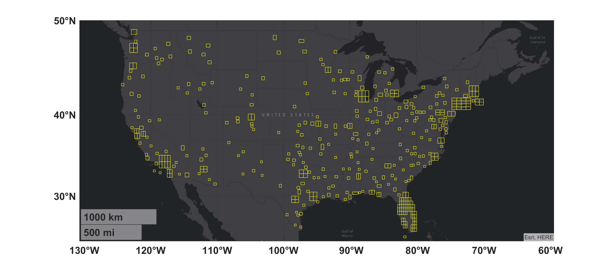
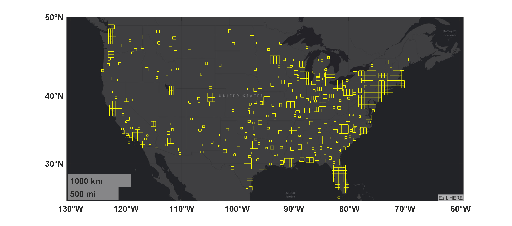
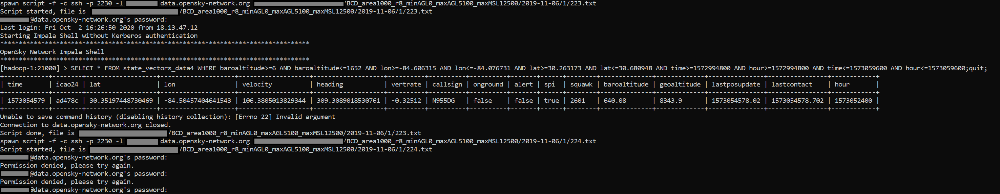

# OpenSky Network Downloading

This repository is a collection of shell scripts and MATLAB code to query the [OpenSky Network](https://github.com/openskynetwork) Impala database and download crowdsourced observations of aircraft. The download data can then processed using the [`em-processing-opensky`](https://github.com/Airspace-Encounter-Models/em-processing-opensky) repository.

- [OpenSky Network Downloading](#opensky-network-downloading)
  - [Point of Contact](#point-of-contact)
  - [Nomenclature](#nomenclature)
  - [Introduction](#introduction)
    - [Contribution](#contribution)
  - [Initial Setup](#initial-setup)
    - [em-core](#em-core)
    - [em-processing-opensky](#em-processing-opensky)
  - [Run Order](#run-order)
    - [Startup script](#startup-script)
    - [1. Create queries](#1-create-queries)
      - [generateQueries_1](#generatequeries_1)
      - [Workflow](#workflow)
      - [Example Queries](#example-queries)
    - [2. Execute queries](#2-execute-queries)
      - [Permission Denied Bug](#permission-denied-bug)
    - [3. Format logs](#3-format-logs)
  - [Citation](#citation)
    - [Software](#software)
    - [Processing](#processing)
    - [OpenSky Network](#opensky-network)
    - [LLSC](#llsc)
  - [Distribution Statement](#distribution-statement)

## Point of Contact

We encourage the use of the [GitHub Issues](https://guides.github.com/features/issues/) but when email is required, please contact the administrators at [encounter-model-ml-admin@mit.edu](mailto:encounter-model-ml-admin@mit.edu). As the encounter models transition to a more community driven effort, a separate mailing list for code discussion may be created.

## Nomenclature

Acronym | Phrase
 :--- | :---
ADS-B | [automatic dependent surveillance – broadcast](https://en.wikipedia.org/wiki/Automatic_dependent_surveillance_%E2%80%93_broadcast)
AGL | above ground level
HPC | high performance computing
LLSC | [Lincoln Laboratory Supercomputing Center](https://www.ll.mit.edu/r-d/cyber-security-and-information-sciences/lincoln-laboratory-supercomputing-center)
MAC | midair collision
MSL | mean sea level

## Introduction

With the integration of unmanned aircraft systems into the U.S. National Airspace System, low altitude regions are being stressed in historically new ways. Unmanned aircraft must operate as to not create a MAC (midair collision) a hazard due to the loss of life and property. The FAA must then understand and quantify the risk of UAS collision with manned aircraft during desired low altitude unmanned operations in order to produce regulations and standards. A key component of these risk assessments are statistical models and characterization of aircraft flight. Recent assessments have been based on data sourced from the OpenSky Network, a crowdsourced ADS-B receiver network that provides open access to the aircraft data. The network, started in 2012 with 12 European sensors, has grown to over a thousand worldwide active sensors. ADS-B Equipped aircraft automatically self-report their position to ground stations and other equipped aircraft. In response, the [`em-processing-opensky`](https://github.com/Airspace-Encounter-Models/em-processing-opensky) repository was developed and released to process OpenSky Network data to support these assessments. To further leverage the OpenSky Network, we developed capabilities to efficiently query the historical OpenSky Network database and store the data.

### Contribution

This software generates and executes queries to download aggregate ADS-B data collected by the OpenSky Network. The download data can then processed using the [`em-processing-opensky`](https://github.com/Airspace-Encounter-Models/em-processing-opensky) repository. Additionally this software is a MATLAB and shell alternative to the Python-based [Xavier Olive's `traffic`](https://github.com/xoolive/traffic) and [Junzi Sun's `pyModeS`](https://github.com/junzis/pyopensky) repositories. The shell scripts can be used independent of the MATLAB software. The software also enables queries based on AGL altitude, aerodromes, airspace class, and time zone.

## Initial Setup

This section specifies the run order and requirements for the initial setup the repository. Other repositories in this organization are reliant upon this setup being completed.

### em-core

If you have not already, complete the initial setup associated with the [`em-core`](https://github.com/Airspace-Encounter-Models/em-core) repository. Notably, the functionality associated with `msl2agl.m` and `RUN_Airspace_1.m` from that repository are required here.

### em-processing-opensky

If you have not already, complete the initial setup associated with the [`em-processing-opensky`](https://github.com/Airspace-Encounter-Models/em-processing-opensky) repository. Notably, the MATLAB code assumes the `AEM_DIR_OPENSKY` persistent system environment has been set. If you're only using the shell scripts from this repository, `AEM_DIR_OPENSKY` does not need to be set.

## Run Order

Code developed and tested for Matlab R2019b in Windows and Unix. The local dev machine had a CPU of Intel Xeon Gold 6130 at 2.10GHz and 64 GB of RAM. The LLSC was also used for large parallel and batch processing; however not all the LLSC code has been publicly released.

### Startup script

At MATLAB startup, run [`startup_opensky`](startup_opensky.m) to set the MATLAB path and configuration. If you're not using the MATLAB code, this step is not required.

### 1. Create queries

First, run [`RUN_generateQueries_1`](RUN_generateQueries_1.m) which calls [`generateQueries_1`](generateQueries_1.m) to generate bounding boxes based on airspace class and aerodromes; and generate list of queries based on the bounding boxes. The user can also define their own bounding boxes by setting `boxLat_deg` and `boxLon_deg`. If these two variables are passed as inputs, steps 1-8 are skipped in the workflow described below. This behavior is demonstrated by [`RUN_generateQueries_1`](RUN_generateQueries_1.m).

While this repository provides a MATLAB example prototype to generate the queries, this step can be accomplished using any programming language.

#### generateQueries_1

Specifically, [`generateQueries_1`](generateQueries_1.m) has the following input parameters:

| Variable  |  Description | Example |
| :-------------| :--  | :-- |
| fileAirspace | Airspace file created in `em-core` | `[getenv('AEM_DIR_CORE') filesep 'output' filesep 'airspace-B-C-D-E-03-Aug-2020' '.mat']`
| outFile | Name of output file with queries | `queries.txt`
| queriesPerGroup | Maximum queries per group | `1000`
| rad_nm | Radius in nautical miles of small circles away from aerodromes | `8`
| areaThres_nm | Maximum bounding box size in nautical miles (will divide boxes larger than this) | `1000`
| classInclude |  Airspace classes to include | `{'B','C','D'}`
| maxConvgInit | Maximum iterations to attempt when unioning bounding boxes | `20`
| minAGL_ft | Minimum barometric altitude (feet AGL) | `0`
| maxAGL_ft | Maximum barometric altitude (feet AGL) | `5100`
| maxMSL_ft | Maximum barometric altitude (feet MSL) | `12500`
| timeStart | Start time | `datetime('2019-11-01 05:00:00')`
| timeEnd | End time | `datetime('2019-11-01 23:00:00')`
| timeStep | Time step | `hours(18)`
| rngSeed | Random seed | `42`
| isWrite | If true, write queries to file | `true`
| isRandomize | If true, randomize order of queries (this often helps with load balancing) | `true`
| isPlotBoundary | If true, plot intermediate boundaries | `false`
| isPlotFinal | If true, plot final bounding boxes | `true`
| boxLat_deg | (Optional) Cell array of latitude coordinates for each bounding box | `{[28.8934625375834;28.8934625375834; 28.0871285009554; 28.0871285009554]}`
| boxLon_deg | (Optional) Cell array of longitude coordinates for each bounding box | `{[-81.3985939300731; -81.0194399160377; -81.0194399160377; -81.3985939300731]}`

The following table overviews the outputs of [`generateQueries_1`](generateQueries_1.m). Note that `minAlt_m_msl` and `maxAlt_m_msl` are in units meters instead of the recommended units feet, per the [Contributing Guidelines](https://github.com/Airspace-Encounter-Models/em-overview/blob/master/CONTRIBUTING.md). Since the OpenSky Network uses units meters, this use of units meters was an acceptable deviation from the guidelines.

| Variable  | Type | Description |
| :-------------| :--  | :-- |
| queries | *N X 1* string | Queries to be executed on OpenSky Network Impala database
| groups | *N X 1* double | Based on `queriesPerGroup`, the group assigned to each bounding box
| boxLat_deg | *N X 1* cell | Latitude coordinates for each bounding box
| boxLon_deg | *N X 1* cell | Longitude coordinates for each bounding box
| minAlt_m_msl | *N X 1* double | Minimum elevation (m MSL) for each bounding box
| maxAlt_m_msl | *N X 1* double | Maximum elevation (m MSL) for each bounding box

#### Workflow

The high level workflow for this step is as follows:

1. Identify aerodromes within or under terminal airspaces​
2. Generate circles around each aerodrome​
3. Union circles to create a boundary of all aerodromes within a specific airspace​

| [KATW](https://skyvector.com/?ll=44.25808500195281,-88.51904296307349&chart=301&zoom=1&fpl=%20N96%20KUNV%20KUNV%20KRVL) | [KBZN](https://skyvector.com/?ll=45.77722154412821,-111.15022658876927&chart=301&zoom=1&fpl=%20N96%20KUNV%20KUNV%20KRVL) |
| :--: | :---:|
|  | 

4. Generate bounding boxes for each boundary​
5. Union bounding boxes to create polygons with only right angles​

| Class D | Class B, C, D
| :--: | :---:|
|  | 

6. Iteratively union polygons to create discrete bounding boxes that do not overlap​
7. For large bounding boxes, divide into smaller bounding boxes​
8. Remove small bounding boxes that are not within or under terminal airspace​

| Class D (499 boxes) | Class B, C, D (695 boxes)
| :--: | :---:|
|  | 
|  | 

9.  For each bounding box, use [NOAA GLOBE](https://www.ngdc.noaa.gov/mgg/topo/globe.html) digital elevation model to estimate the min/max elevation ​
10. Based on elevation, calculate the potential MSL altitude given AGL altitude range
11. For each bounding box, identify time zone based on longitude (meridian-based)​
12. Generate queries based on bounding box, MSL altitude, and local time
13. Assign a group to each query to facilitate load balancing and storage optimization

#### Example Queries

``` sql
SELECT * FROM state_vectors_data4 WHERE baroaltitude>=224 AND baroaltitude<=1981 AND lon>=-84.668913 AND lon<=-84.235492 AND lat>=33.619715 AND lat<=34.239499 AND time>=1577833200 AND hour>=1577833200 AND time<=1577898000 AND hour<=1577898000;quit;
SELECT * FROM state_vectors_data4 WHERE baroaltitude>=8 AND baroaltitude<=1631 AND lon>=-81.610597 AND lon<=-81.268535 AND lat>=27.819678 AND lat<=28.320688 AND time>=1572588000 AND hour>=1572588000 AND time<=1572591600 AND hour<=1572591600;​quit;
```

### 2. Execute queries

Assuming the queries were written to a file, they can be executed and have data downloaded using the shell script, [`execQuery_2`](execQuery_2.sh). It has three inputs and will prompt the user for their OpenSky network password when the script is executed. Note since the OpenSky Network does not support SSH key for access, the script uses [`expect`](https://en.wikipedia.org/wiki/Expect) to access the database when iterating over queries. For security, [`execQuery_2`](execQuery_2.sh) can prompt the user for the OpenSky Network username and password at runtime.

For serial operations, [`RUN_execQuery_2`](RUN_execQuery_2.sh) will first prompt for the OpenSky Network username and password. The script can then be modified at the bottom to serially execute multiple calls of [`execQuery_2`](execQuery_2.sh).

| Input  |  Name | Description |
| :-------------| :--  | :-- |
| $1 | INQUERIES | Name of file containing queries
| $2 | OUTDIR | Name of output directory where we write the logs to
| $3 | OSNUSER | OpenSky Network username
| $4 | PASSWORD | OpenSky Network password

#### Permission Denied Bug

The [`expect`](https://en.wikipedia.org/wiki/Expect) functionality in [`execQuery_2`](execQuery_2.sh) is not completely robust. On occasion the OpenSky Network Impala database will refuse the password, display "Permission denied, please try again" and prompt for the password again. Currently, [`execQuery_2`](execQuery_2.sh) can not automatically handle this event. The user must manually input their password to continue but then [`execQuery_2`](execQuery_2.sh) will resume working as intended.



The logged .txt file for this iteration will not contain the query results. Instead it will look like this:

``` shell
Script started on 2020-10-02 16:09:38-0400
USER@data.opensky-network.org's password: 
Permission denied, please try again.

USER@data.opensky-network.org's password: 
Permission denied, please try again.

USER@data.opensky-network.org's password: 
Connection closed by 194.209.200.3 port 2230


Script done on 2020-10-02 18:17:41-0400
```

If querying the OpenSky Network constantly, this bug should occur for less than 1% of queries and may appear after several hours of runtime.

### 3. Format logs

Once downloaded, the logs can be formatted individually using the shell script, [`formatLogs_3`](formatLogs_3.sh), or serially batched processed using [`RUN_format_3`](RUN_format_3.sh). The [`formatLogs_3`](formatLogs_3.sh) script has the following parameters:

| Input  |  Name | Description |
| :-------------| :--  | :-- |
| $1 | INFILE | Name of file containing logged OpenSky query generated in [Step 2](#2-execute-queries)
| $2 | OUTFILE | (optional) Name of CSV formatted log

## Citation

Please use the appropriate documents listed in [`em-overview/README`](https://github.com/Airspace-Encounter-Models/em-overview/blob/master/README.md#documentation) when citing the technical concepts.

### Software

Please use this DOI number reference when citing the software:

**Fill in once released**

### Processing

For referencing the use of OpenSky Network data for encounter model development, please use this current article:

<details> <summary> A. Weinert, N. Underhill, B. Gill, and A. Wicks, “Processing of Crowdsourced Observations of Aircraft in a High Performance Computing Environment,” arXiv:2008.00861 [cs], Aug. 2020.</summary>
<p>

```tex
@article{weinertProcessingCrowdsourcedObservations2020,
  url = {http://arxiv.org/abs/2008.00861},
  archivePrefix = {arXiv},
  eprinttype = {arxiv},
  eprint = {2008.00861},
  primaryClass = {cs},
  title = {Processing of {{Crowdsourced Observations}} of {{Aircraft}} in a {{High Performance Computing Environment}}},
  author = {Weinert, Andrew and Underhill, Ngaire and Gill, Bilal and Wicks, Ashley},
  month = aug,
  year = {2020},
  keywords = {Computer Science - Computational Engineering; Finance; and Science,Computer Science - Distributed; Parallel; and Cluster Computing,E.2,H.3,I.6.5}
}
```
</p>
</details>

### OpenSky Network

For referencing the OpenSky Network itself, please use this article:

<details> <summary> M. Schäfer, M. Strohmeier, V. Lenders, I. Martinovic and M. Wilhelm, "Bringing up OpenSky: A large-scale ADS-B sensor network for research," IPSN-14 Proceedings of the 13th International Symposium on Information Processing in Sensor Networks, Berlin, 2014, pp. 83-94.</summary>
<p>

```tex
@inproceedings{weinertDevelopingLowAltitude2019,
	title = {Bringing Up OpenSky: A Large-scale ADS-B Sensor Network for Research},
	url = {https://doi.org/10.1109/IPSN.2014.6846743},
	doi = {10.1109/IPSN.2014.6846743,
	language = {en},
  booktitle={IPSN-14 Proceedings of the 13th International Symposium on Information Processing in Sensor Networks}, 
  author={M. {Schäfer} and M. {Strohmeier} and V. {Lenders} and I. {Martinovic} and M. {Wilhelm}},
  month = apr,
  year = {2014},
	pages = {83--94}
}
```
</p>
</details>

### LLSC

The Lincoln Laboratory Supercomputing Center was used by MIT LL when prototyping this software. When referencing the LLSC, please use this article:

<details> <summary> A. Reuther et al., "Interactive Supercomputing on 40,000 Cores for Machine Learning and Data Analysis," 2018 IEEE High Performance extreme Computing Conference (HPEC), Waltham, MA, 2018, pp. 1-6, doi: 10.1109/HPEC.2018.8547629.</summary>
<p>

```tex
@inproceedings{llsc2018,
  author={A. {Reuther} and J. {Kepner} and C. {Byun} and S. {Samsi} and W. {Arcand} and D. {Bestor} and B. {Bergeron} and V. {Gadepally} and M. {Houle} and M. {Hubbell} and M. {Jones} and A. {Klein} and L. {Milechin} and J. {Mullen} and A. {Prout} and A. {Rosa} and C. {Yee} and P. {Michaleas}},
  booktitle={2018 IEEE High Performance extreme Computing Conference (HPEC)},
  title={Interactive Supercomputing on 40,000 Cores for Machine Learning and Data Analysis},
  volume={},
  number={},
  pages={1-6},
  month = july
  year={2018},
  doi = {10.1109/HPEC.2018.8547629},
  url = {https://doi.org/10.1109/HPEC.2018.8547629},
}
```

</p>
</details>

## Distribution Statement

DISTRIBUTION STATEMENT A. Approved for public release. Distribution is unlimited.

© 2018, 2019, 2020 Massachusetts Institute of Technology.

This material is based upon work supported by the Federal Aviation Administration under Air Force Contract No. FA8702-15-D-0001.

Delivered to the U.S. Government with Unlimited Rights, as defined in DFARS Part 252.227-7013 or 7014 (Feb 2014). Notwithstanding any copyright notice, U.S. Government rights in this work are defined by DFARS 252.227-7013 or DFARS 252.227-7014 as detailed above. Use of this work other than as specifically authorized by the U.S. Government may violate any copyrights that exist in this work.

Any opinions, findings, conclusions or recommendations expressed in this material are those of the author(s) and do not necessarily reflect the views of the Federal Aviation Administration.

This document is derived from work done for the FAA (and possibly others), it is not the direct product of work done for the FAA. The information provided herein may include content supplied by third parties.  Although the data and information contained herein has been produced or processed from sources believed to be reliable, the Federal Aviation Administration makes no warranty, expressed or implied, regarding the accuracy, adequacy, completeness, legality, reliability or usefulness of any information, conclusions or recommendations provided herein. Distribution of the information contained herein does not constitute an endorsement or warranty of the data or information provided herein by the Federal Aviation Administration or the U.S. Department of Transportation.  Neither the Federal Aviation Administration nor the U.S. Department of Transportation shall be held liable for any improper or incorrect use of the information contained herein and assumes no responsibility for anyone’s use of the information. The Federal Aviation Administration and U.S. Department of Transportation shall not be liable for any claim for any loss, harm, or other damages arising from access to or use of data or information, including without limitation any direct, indirect, incidental, exemplary, special or consequential damages, even if advised of the possibility of such damages. The Federal Aviation Administration shall not be liable to anyone for any decision made or action taken, or not taken, in reliance on the information contained herein.
